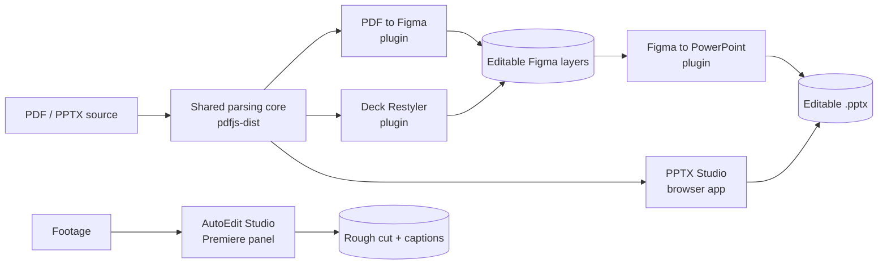

AI Designer Studio is the front door to a set of internal tools for a design
team: deck conversion, restyling, and video automation across Figma, PowerPoint
and Premiere Pro. The directory itself is a Vite + React app on the Carbon
Design System, and it does one thing carefully — it tells the truth about what
exists and what state each tool is in.

Versions are not hand-maintained. A sync script reads each tool's own source of
truth before every dev run and build: `package.json` for the four Figma and web
tools, and `CSXS/manifest.xml` for the Premiere panel, because CEP extensions
don't use `package.json` at all. A repo that isn't checked out next to the
directory is a warning rather than a failure — the last generated value stands.

## The tools

- **PDF to Figma** — parses an uploaded PDF entirely in the browser and rebuilds each page as an editable Figma frame: separate text, image, and true vector layers at their original coordinates.
- **Deck Restyler** — forked from PDF to Figma. Extracts a reusable Style Kit (colors, fonts, logo) from a Design Deck and remaps a Content Deck onto it. v1 is restyle-only: every element keeps its original position and size.
- **Figma to PowerPoint** — the mirror image. Selected frames export to an editable `.pptx` where text and simple shapes are real, selectable PowerPoint objects rather than a flattened screenshot.
- **PPTX Studio** — the same conversion core, lifted out of Figma into a fully client-side web app. Uploaded decks never leave the browser.
- **AutoEdit Studio** — a Premiere Pro panel for automated rough cuts, backed by a local Express and ffmpeg service running Whisper transcription on the editor's own machine.

## Architecture

## What I would change

The four Figma and web tools have no git history, no tags, and no changelog —
their `package.json` has read `1.0.0` since creation. The version sync script
is honest about this, but the numbers only start meaning something once those
repos actually version themselves.
