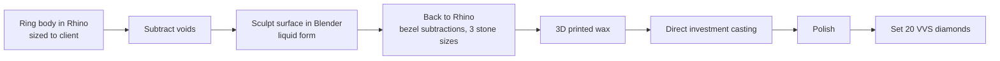

What started off as a heavily structure ask, developed into the ultimate display of fluidity. This custom set of rings was designed in Rhino 3D. I start with a basic ring body sized to the clients specifications then subtracted holes into the ring. I brought the ring into Blender to create sculpt the surface created the liquid effect depicted in the final result. Once the surface is complete I pulled the rings back into Rhino to create bezel setting subtractions for 3 sizes of VVS diamonds. 

I then casted the ring using direct investment casting. Polished and set the diamonds.

## From CAD to cast

