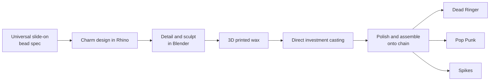

The mission was to transition from standalone, single-piece jewelry design into a scalable, collection-based architecture for Spring 2026, leveraging the high-LTV mechanics that built Pandora into a global powerhouse.

 **The Pandora Blueprint:** Charms and charm bracelets form the engine of Pandora’s $5B+ business, historically generating 60%–75% of total brand revenue and moving roughly three pieces of jewelry every second globally—proving that modularity accelerates repeat purchases and customer lifetime value.

 **Modular Mechanics:** Engineered a scalable, friction-free system using a universal slide-on bead design that fits directly over chain links, eliminating mechanical complexity while prioritizing collector interchangeability.

 **Curated Series:** Prototyped over 30 charms, toggles, and connectors before distilling the collection into three focused aesthetic stories: _Spikes_, _Dead Ringer_, and _Pop Punk_.

 **Phased Rollout:** Launched Phase 1 (Bracelets) to establish the foundational hardware and silhouette, setting up an immediate bridge into Phase 2: _Charm’d Earrings_.

 **Core Objective:** Shift from one-off product drops to a collectible, repeatable ecosystem that encourages ongoing customer curation.

## From one bead spec

