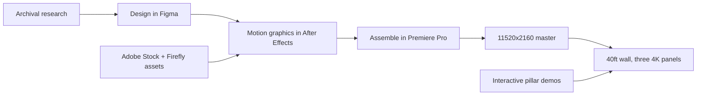

The mission was to activate IBM’s NYC Innovation Studio for an executive visit with the Depository Trust & Clearing Corporation (DTCC), transforming the 40ft video wall and interactive pillars into a bespoke showcase honoring their centennial milestone alongside modern IBM technology.

 **40ft Video Wall Narrative:** Centered around an animated motion-graphic timeline tracking DTCC’s 100-year history of technological advancement, flanked by archival footage, milestone imagery, and contextual visuals.

 **Interactive Scannable Deep Dives:** Embedded QR codes throughout the video wall displays, allowing attendees to instantly pull up architectural documentation and product specs on their mobile devices.

 **Custom Pillar Experiences:** Built DTCC-branded interactive demos across four touch-screen pillars to provide hands-on engagement with IBM Bob, watsonx Orchestrate, IBM Z infrastructure, and Project Mythos.

 **Core Objective:** Deliver a high-touch, immersive executive briefing that bridged commemorative heritage storytelling with tangible, interactive proof points across the IBM portfolio.

## Production pipeline

