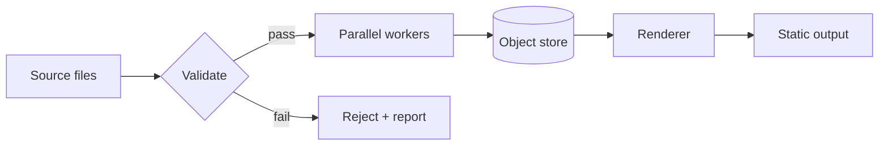

---
# ─────────────────────────────────────────────────────────────────────
# TEMPLATE / SCHEMA REFERENCE. Every value below is a placeholder.
# Copy this file, rename it to your slug, replace all of it.
# ─────────────────────────────────────────────────────────────────────
title: Example Project
tagline: A one-line statement of what this is and why it was hard.
category: software
role: Sole architect and engineer — schema design, build pipeline, deploy.
date: 2026-02-14
published: false
order: 1

live_url: https://example.com
repo_url: https://github.com/kendallwillis/example-project

featured_preview:
  kind: video
  poster: /media/_example/poster.avif
  webm: /media/_example/preview.webm
  mp4: /media/_example/preview.mp4
  duration_s: 4.5
  bytes: 2411724
  width: 1280
  height: 720
  alt: Screen recording of the example application processing a document.

deep_dive_media:
  - kind: r2
    src: https://media.example.com/example/turntable-1080.mp4
    caption: Full 24-second turntable, 1080p, H.264.
  - kind: vimeo
    id: "000000000"
    caption: Narrated walkthrough of the processing pipeline.

tech_stack:
  cad_3d: []
  frontend_logic: [TypeScript, Astro, Web Components]
  motion_compositing: []
  ai_orchestration: [Claude API, MCP]
  infrastructure: [GitHub Actions, Cloudflare R2]

llm_orchestration:
  summary: An MCP server exposed the document parser as tools so the model could drive extraction end to end.
  models: [claude-opus-5]
  patterns: [mcp-server, structured-extraction]
  autonomy: semi-autonomous
  human_in_the_loop: Every extraction was reviewed against a 40-document gold set before promotion.

pipeline_diagram:
  title: Ingest to render pipeline
  kind: system-architecture
  caption: Source documents fan out to parallel workers; only validated output reaches the renderer.

engineering_challenge:
  constraint: Placeholder — state the single bottleneck in one or two sentences, with the number that made it a bottleneck.
  resolution: Placeholder — state what you changed and why that specific change removed the constraint.

metrics:
  - label: Placeholder metric
    value: "00s"
    baseline: "00s"
    delta: "-00%"
    method: How this was measured, so a skeptical reader can check it.
---

## The bottleneck

Long-form narrative goes here. Frontmatter carries the structured facts; this
body carries the reasoning. Headings, code blocks, and images all work.

## Architecture

The fence below is the real diagram source. `rehype-mermaid` renders it to
inline SVG during `astro build` — no Mermaid JavaScript reaches the browser.

## What I would change

Close with the honest retrospective. This section is what separates a case
study from a portfolio caption.
