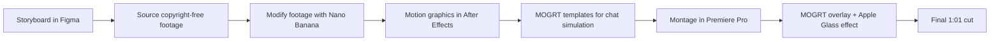

The mission was to build a one-minute concept video showing how watsonx
Orchestrate could transform Mastercard's concierge app into a proactive,
agentic assistant tied to their "Priceless" partnerships.

**Format:** A 60/40 split between real-world cardholder perks and mobile UI
chat simulations.

- **Sports (Liverpool FC):** Showcases exclusive access by securing after-hours player Q&A passes.
- **Music (Live Nation):** Highlights automated ticket-hunting and priority presale booking based on user preferences.
- **Gaming (LoL World Finals):** Illustrates an immediate jump from home to live event perks through interactive, transparent chat pop-ups.

**Key objective:** Prove watsonx Orchestrate's mobile agentic capabilities to
drive cardholder engagement and partner revenue.

## Production pipeline

