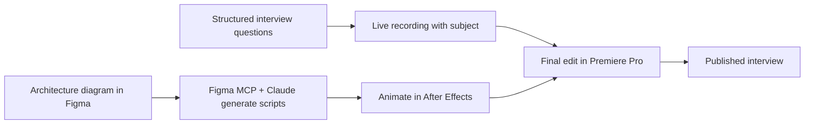

The mission was to capture leadership articulating why the Must Wins strategy
is critical for 2026, increase executive visibility across IBM, and translate
high-level business drivers into practical sales inspiration.

- **Executive storytelling:** Interviewed leadership using structured questions to break down client cost pressures, the end of "big bang" modernizations, and the shift toward incremental business value.
- **Interactive architecture hub:** Built a companion landing page that visually maps the full client journey alongside the supporting technology architecture.
- **Applied use cases:** Grounded the strategy in concrete scenarios — such as real-time banking offers — to show how targeted modernization directly unlocks new lines of business in Financial Services.

**Core objective:** Bridge the gap between leadership strategy and technical
execution, giving teams a tangible blueprint to drive pipeline and revenue.

## Production pipeline

