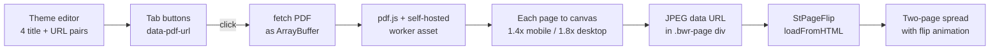

## Why build it instead of paying for it

I was already paying for Flipsnack Business — $85/mo, $1,020/yr, the top
self-serve tier. That matters, because the problems below are not the ones you
fix by upgrading. I was already at the top.

**The lookbook lived somewhere else.** The zines are sales material — line
sheets and lookbooks that go to buyers, stockists and customers. Hosted on a
third-party flipbook platform, sharing them meant sending two links: one to the
store, where the products are, and one to a stranger's domain, where the
lookbook is. Every reader who wanted to actually buy something had to find
their own way back. The catalogue and the checkout were on different websites.

**The rest of the deterrents, in the order they mattered:**

- **$1,020 a year for a feature that is 10 KB of theme code.** The plan renewed
  whether or not a new zine shipped that month, and the price scales with
  publication count, not with value delivered. Four zines a year is $255 each.
- **Traffic leaves the store.** A hosted flipbook is a page view on the
  vendor's domain, not yours. No product links, no cart, no session, and none
  of it lands in Shopify analytics — so the lookbook that drove a sale is
  invisible in the store's own reporting.
- **The SEO goes to the host.** Any indexing credit for the catalogue accrues
  to the platform's domain rather than badwithoutreason.com.
- **A custom domain is the most expensive thing on the price list, and it still
  isn't your store.** Flipsnack gates custom domains behind Business — the
  $85/mo tier I was on. The best outcome money can buy there is a nicer address
  for the second website. It never puts the zine next to the products.
- **Still metered, at the top tier.** Business caps at 100 flipbooks of 500
  pages. Paying the most on the list does not mean paying for "unlimited"; the
  next stop is a custom Enterprise contract.
- **Seats cost extra on top.** $25/mo per additional editor.
- **Link rot on material already sent out.** Every share link lives on someone
  else's platform. Cancel the plan, hit a tier limit, or have the vendor change
  pricing or sunset the product, and the lookbooks already in a buyer's inbox
  stop resolving. Self-hosting makes a dead zine impossible as long as the store
  exists.
- **Third-party script weight.** App-based flipbooks inject a vendor bundle into
  the storefront. This section loads its libraries only on the one page that
  uses them.

Rebuilding it took a weekend. It has cost nothing since, and the lookbooks now
live at the same address as the products they sell.

## What it is

A single Online Store 2.0 section, `sections/flipbook-pdf.liquid`, bound to the
Product Zines page through `templates/page.product-zine.json`. It takes up to
four hosted PDF lookbooks and presents them as a two-page spread with a real
page-turn animation — no flipbook app, no subscription, and no pre-rendered
image sets sitting in the asset folder.

**Merchant-configurable, not hardcoded.** The schema exposes four title/URL
pairs. Titles truncate at 15 characters so the tab row never wraps; any slot
left blank renders its button disabled rather than broken. Swapping a zine is
pasting a new Shopify Files URL in the theme editor — no code change, no
redeploy.

**Rendering happens client-side, on demand.** Clicking a tab fetches the PDF as
an ArrayBuffer, pushes it through pdf.js, and rasterises every page to a canvas
at a scale chosen from viewport width. Each canvas becomes a JPEG data URL
inside a `.bwr-page` div, and the finished set is loaded into StPageFlip. An
`aria-live` status region announces "Rendering page 3 of 12…" and clears itself
on completion.

**The failure modes it was actually built against.** The libraries load with
`defer` while the inline script runs on `DOMContentLoaded`, so a polling guard
waits up to 12 seconds for `window.pdfjsLib` and `window.St.PageFlip` before
throwing a legible error. Switching zines mid-render trips an abort token that
is checked between every page, so a half-rendered book never bleeds into the
next one. And StPageFlip's own wrapper elements fight the container, so the
section overrides `.stf__parent`, `.stf__block` and `.stf__wrapper` to fill the
frame and centre the single-page cover view.

**Scoped to its own instance.** Every query runs against
`[data-bwr-section-id="{{ section.id }}"]`, so dropping a second Product Zine
section on the same page does not have the two viewers stealing each other's
buttons.

## PDF to flipbook, entirely in the browser

