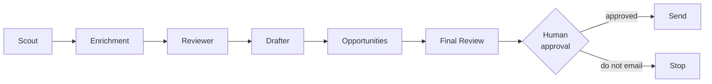

Bad Without Reason is a Brooklyn punk-modern jewelry brand, and growing its
wholesale side means finding the right independent boutiques, writing to them in
a way that doesn't read as templated, and not losing the thread on follow-ups.

## Why hand it to agents

I was spending about **two hours a day** on that. The return on those hours is
worse than it feels — the average cold email reply rate is now around **3.4%**,
down from 8.5% in 2019, so most of that work goes into messages nobody answers.

None of it is judgment work. The judgment is which stores are actually right,
what the emails sound like, which openings are landing, and how a negotiation
goes once someone replies. So the pipeline got the research and the drafting,
and I kept the decisions.

## The agents, and the one human gate

- **Scout** — searches the web for candidate boutiques and concept stores, cross-referenced against tracked retailers so nothing is added twice.
- **Enrichment** — fills in vendor type, fit reasoning and email for anything added bare by hand.
- **Reviewer** — reads Gmail threads and classifies replies, separately detecting bounces so a delivery failure is never mistaken for a real answer.
- **Drafter** — writes first-touch outreach and 10-day nudges in three voices calibrated from mail I had already sent and had land, as Gmail drafts only.
- **Opportunities** — researches trade shows and marketplaces and analyses how the pipeline itself is performing.
- **Final Review** — the automated pre-send gate: valid address, a real non-empty draft, no placeholder text, no duplicate recipient.

Each is a standalone Python script reading and writing one Google Sheet as the
shared system of record. Every stage reads the full sheet and writes back only
the rows it touched, so the pipeline is safe to re-run at any time.

**The safety model is the point.** Nothing here can email a vendor. The agents
create drafts and sheet rows; one separate script can send, defaults to a dry
run, and needs `--confirm`; a `do_not_email` flag is checked at every stage. The
only thing still on my desk is the send decision, which is where I wanted it.
