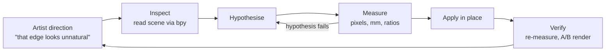

A jewelry vitrine, staged from a bare case on a wood floor into a furnished
retail room: 15 books, 9 records, a bench, a leaning mirror, a slat wall, and
eleven pieces of jewelry on the pad. Blender 5.2 LTS, Cycles, 1080 × 1920.

## Why this scene

**A real test of Blender MCP + Claude** — not a demo prompt, but a scene I cared
about, with enough surface area to find the edges: procedural geometry, shader
debugging, physical lighting, asset sourcing, camera animation.

**And a step up in production value.** My previous renders drew more interest
than I expected, so the next move was putting the pieces in a *place* rather
than on a plinth. A retail room needs set dressing — a volume of asset work
that normally decides against itself.

It all ran against a **live Blender session over an MCP bridge** — scene state
read through `bpy`, changes applied in place, renders fired and measured in the
same loop.

## Direction in, evidence out

## Making it read as real

A jewelry render gets judged on things the viewer already knows by heart. Four
of them decided this frame.

**The light.** The HDRI was measured, not trusted — linearized it sits at
xy (0.3147, 0.3276), essentially D65. That ruled the environment out as the
source of a warm cast and pointed at the storefront daylight instead: two
7000 K panels outside the windows contributing nothing. Rebuilding around what
each source actually contributes took the pad from R/B 1.303 to 1.009.

**Silver that oxidises where silver oxidises.** A warm sterling base rather than
neutral chrome — chrome is the fastest way to make a ring look rendered —
against a near-black patina, roughness on the same mask at 0.10 polished and
0.66 oxidised. The mask is baked cavity data, so darkening sits in the
recesses.

**Glass and mirror that reflect a real room.** Low-iron glass, chosen because it
doesn't tint what passes through it, and the mirror built to real HOVET
dimensions. Their job is to carry the brick, the slat wall, the storefront
light — get the spec wrong and they reflect something subtly invented.

**Set dressing a person would own.** This carries the vibe and can't be faked
with generic props. The records are real releases with real cover art, pulled by
API, with non-square covers padded rather than centre-cropped. The ledges sit at
1499.5 mm, standing eye level.

## Automating the book library

Fifteen books is where a scene like this normally stops being worth it, so the
pipeline runs from a spreadsheet instead of by hand.

**A Google Sheet is the manifest.** One row per book carries dimensions, artwork
and shelf position, and drives geometry, materials, textures and packing — so
adding a title is editing a row, not modelling an object. One limitation worth
knowing: the Sheets connector can't write cells at all, so computed results land
in a CSV alongside rather than back in the sheet.

**Proportions come from the artwork, laid out through the Figma MCP.** A
detector finds the spine folds in a flat scan; one real measurement fixes the
scale. It scored 0 px error on two books whose answer was known — then returned
a confident 2.2 mm spine on a 235 mm book whose cover is black edge to edge,
with no luminance edge to find. The guards that came out of that later caught a
second all-black cover doing the same thing. The wrap templates themselves are
published into Figma through the MCP, a frame per book with guides measured off
the built mesh rather than calculated.

## What the test showed

**Reading the live scene is the whole advantage.** Black glass turned out to be
two panes matching to four decimal places. That isn't visible in a render — only
in the scene graph.

**The bottleneck is verification, not generation.** Building a shader or a
generator was the fast part. What made the output trustworthy was measuring it.

**Label things properly.** A datablock still called `Clothing store pink warm
light` long after that environment was swapped out sent the first lighting
diagnosis in the wrong direction. Names are the cheapest documentation a scene
file has, and they only stay useful if they're updated when the thing behind
them changes.

**The set-dressing volume became affordable** — the week of asset work that
would otherwise have talked me out of the shot.
