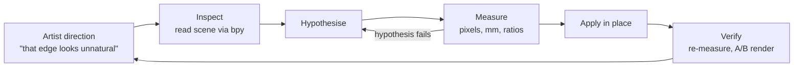

A jewelry vitrine, staged from a bare case on a wood floor into a furnished
retail room: 15 books, 9 records on two ledges, a bench, a leaning mirror, a
slat wall, and eleven pieces of jewelry on the pad. Blender 5.2 LTS, Cycles,
1080 × 1920 at 300 samples.

## Why this scene

Two things at once.

**A real test of Blender MCP + Claude.** Not a demo prompt — a scene I actually
cared about, with enough surface area to find the edges: procedural geometry,
shader debugging, physical lighting, asset sourcing, camera animation. I wanted
to know where an agent driving Blender directly is genuinely useful and where it
isn't, and the only way to find that is to give it work that can be checked.

**Elevating the renders.** My previous jewelry renders got far more interest than
I expected, and the obvious next move was production value: put the pieces in a
*place* rather than on a plinth. A retail room needs set dressing — books with
real covers, records with real artwork, furniture built to real product specs —
and that is a volume of asset work that normally decides against itself. Whether
that volume becomes affordable was the second thing being tested.

The work ran against a **live Blender session over an MCP bridge** — scene state
read directly through `bpy`, changes applied in place, renders fired and
measured in the same loop. Two more bridges were in play: Figma, for the book
cover templates, and web APIs for sourcing artwork and product specs. Nothing
was written to disk during the sessions, so every change stayed mine to keep or
discard.

## Direction in, evidence out

## Making it read as real

A jewelry render gets judged on things the viewer already knows by heart. Four
of them decided this frame.

**The light in the room.** The environment was measured rather than trusted —
latitude-weighted and linearized, the HDRI sits at xy (0.3147, 0.3276),
essentially D65, with the upper hemisphere leaning very slightly blue. That
mattered because it ruled the environment out as the source of a warm cast the
render clearly had, and pointed at the storefront daylight instead: two large
7000 K panels outside the windows that were contributing nothing. Rebuilding
around what each source actually contributes — rather than what its name
suggested — took the jewelry pad from R/B 1.303 to 1.009, dead neutral.

**Silver that oxidises where silver oxidises.** Sterling base at
0.962 / 0.949 / 0.902 — deliberately warm, not neutral chrome, because neutral
chrome is the fastest way to make a ring look rendered. Against it, a near-black
patina at 0.030 / 0.027 / 0.024, with roughness driven by the same mask: 0.10
where the piece is polished, 0.66 where it has oxidised. The mask is baked cavity
data, so the darkening actually sits in the recesses. A live ambient-occlusion
node was tried first and barely registered on the imported meshes while adding
render noise; baking is both cleaner and free at render time. Because the raw
bakes varied enormously between pieces — one mean at 0.02 against another at
0.42 — each object's cavity channel is percentile-normalised independently before
the shared material reads it.

**Glass and mirror that reflect a real room.** The case uses a low-iron glass
spec, chosen precisely because it is neutral and doesn't tint what passes through
it, and the leaning mirror was built to the real HOVET product dimensions —
78 × 196 cm at a 4° lean. Both are large reflective surfaces facing the camera,
so their job is to carry the room: the brick, the slat wall, the storefront
light. Get the spec wrong and they reflect something subtly invented, which is
the tell.

**Set dressing a person would actually own.** This is the part that carries the
vibe, and it can't be faked with generic props. The nine records are real
releases with real cover art — seven pulled from the iTunes Search API, two that
aren't in that catalogue sourced through MusicBrainz into the Cover Art Archive.
Three titles in the source list were wrong and were corrected against the actual
releases. Three covers weren't square and were **padded with each cover's own
median border colour rather than centre-cropped**, because a centre crop would
have cut artwork off. The ledges sit at 1499.5 mm — standing eye level, not an
arbitrary height.

## Automating the book library

Fifteen books is where a scene like this normally stops being worth it, so the
book pipeline was built to run from a spreadsheet rather than by hand.

**A Google Sheet is the manifest.** One row per book carries its dimensions,
artwork and shelf position, and that sheet drives everything downstream —
geometry, materials, texture generation and shelf packing — so adding a title is
editing a row, not modelling an object. Packing reproduces the rule arrived at by
hand: anything that fits the 227 mm usable depth gets its spine aligned 8 mm
inside the lip, anything deeper sits flush to the wall panel and juts, and
overflow is reported rather than quietly stacked into the wall.

One honest limitation: the Sheets connector **cannot write cells at all** — its
only write tool handles the file's title and folder location — so computed
results land in a CSV alongside rather than back in the sheet. That was worth
knowing before designing a round-trip that couldn't exist.

**Proportions come from the artwork, via the Figma MCP.** Given a flat wrap scan,
a book's proportions are recoverable: find the spine folds, and one real
measurement fixes the scale. The detector scored 0 px error on two books whose
answer was already known — then returned a confident **2.2 mm spine on a 235 mm
book** whose cover is black edge to edge, because with no luminance edge at the
folds it locked onto text near the centre. Two guards came out of that failure,
and both later caught a second all-black cover doing the same thing. Validating
against known answers first is the only reason a badly wrong object didn't ship
with its artwork stretched across it.

The wrap templates themselves were published into Figma through the **Figma
MCP** — a frame per book with real Figma guides on every band boundary, a
hideable overlay group, and a caption carrying the pixel coordinates, so artwork
can be laid out against the actual geometry instead of an assumed one. The groove
zones were **measured off the built mesh rather than calculated**, and they land
somewhere counter-intuitive: outside the spine band and inside the cover bands,
about 22 px clear on each side. A designer would reasonably assume they straddle
the fold.

## What the test showed

**Reading the live scene is the whole advantage.** Working against `bpy` in the
running session rather than exported files is what made diagnosis possible.
Black glass turned out to be two panes matching to four decimal places; the warm
cast was a hidden render flag; soft focus was four focus empties stranded after
the case moved. None of those are visible in a render — only in the scene graph,
and only if something can query it.

**The bottleneck is verification, not generation.** Building a book generator or
a shader was the fast part. What made the output trustworthy was measuring it,
and every time that step was skipped something wrong got through.

**Names and labels lie.** A datablock called `Clothing store pink warm light`
had nothing to do with the warm cast. Anything inferred from a label needs
measuring before it's acted on.

**Short, specific direction beats a brief.** The notes that changed the work most
were one-liners — *"the book seems a bit flat, like a cube"*, *"note the
dimensions are different"*. Naming the thing that looks wrong is a more
efficient input than describing what would look right.

**The set-dressing volume became affordable.** Fifteen books with correct spine
widths, nine records sourced by API, furniture reverse-engineered to real product
specs. That is the week of asset work that would otherwise have talked me out of
the shot.
