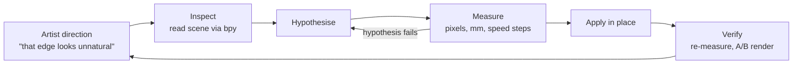

A jewelry vitrine, staged from a bare case on a wood floor into a furnished
retail room: 15 books, 9 records on two ledges, a bench, a leaning mirror, a
slat wall, and eleven pieces of jewelry on the pad. Blender 5.2 LTS, Cycles,
1080 × 1920 at 300 samples.

## Why this scene

Two things at once.

**A real test of Blender MCP + Claude.** Not a demo prompt — a scene I actually
cared about, with enough surface area to find the edges: procedural geometry,
shader debugging, physical lighting, asset sourcing, camera animation. I wanted
to know where an agent driving Blender directly is genuinely useful and where it
isn't, and the only way to find that is to give it work that can be checked.

**Elevating the renders.** My previous jewelry renders got far more interest than
I expected, and the obvious next move was production value: put the pieces in a
*place* rather than on a plinth. A retail room needs set dressing — books with
real covers, records with real artwork, furniture built to real product specs —
and that is a volume of asset work that normally decides against itself. Whether
that volume becomes affordable was the second thing being tested.

The work ran against a **live Blender session over an MCP bridge** — scene state
read directly through `bpy`, changes applied in place, renders fired and
measured in the same loop. Two more bridges were in play: Figma, for the book
cover templates, and web APIs for sourcing artwork and product specs. Nothing
was written to disk during the sessions, so every change stayed mine to keep or
discard.

## Direction in, evidence out

## Measure, don't eyeball

The rule that shaped the whole build: **a method that can't be checked isn't
evidence.** Three cases where it changed the answer.

**Ring orientation.** Bounding boxes couldn't resolve which way eight imported
rings should lie — Bonering is 25 × 26 × 22 mm, no obviously thin axis. Instead
of guessing, the finger hole was detected directly: project the mesh down each
axis, rasterise, flood-fill the exterior, measure the largest *enclosed* void.
Validated first against rings whose answer was already known (CoinEdgeRing 18.7
mm on local Y, Crossband 19.7 mm on local Z), and it self-reported its own
failure on RivetRiotRing, which was resolved by band extent instead. Three of
the eight turned out to be Z-up in source and would have stood on edge at the
importer default. Amorphous_Pinky's 15.4 mm hole, measurably smaller than the
rest, independently confirmed it as a pinky ring.

**Book dimensions from artwork.** A detector recovers a book's proportions from
a flat wrap scan by finding the spine folds. It scored 0 px error on two books
whose answer was known — then returned a confident **2.2 mm spine on a 235 mm
Tom Ford book**, because that cover is black edge to edge and there is no
luminance edge at the folds. Two guards came out of that failure, and both later
caught Dior doing exactly the same thing at 2.05%. Without validation against
known answers first, a badly wrong object would have shipped with the artwork
stretched across it.

**Camera handoff.** A new dolly opening had to release into the existing arc
without a visible kick. The first pass produced a **4× speed step** at the
handoff. Four release frames were tested against two easing schemes, each scored
on the worst single-frame speed change — 0.04812 down to 0.00094. That is the
kind of fault that is hard to see and easy to ship broken.

## The warm cast

Worth its own section, because the obvious answer was wrong twice over.

The world datablock is named `Clothing store pink warm light.001`. That name is
**stale** — a leftover from a BlenderKit HDRI still sitting unused in the file.
The actual environment measured near-neutral, xy (0.3147, 0.3276) against D65 at
(0.3127, 0.3290), with the upper hemisphere leaning slightly *blue*. A genuinely
warm environment reads R/G ≈ 1.5+; this one is 1.041.

The real cause: `SKY Panel Back` and `SKY Panel Right`, two large 7000 K area
lights outside the storefront glass, had `hide_render = True`. The scene's cool
daylight fill was switched off, leaving six 3900 K downlights and red brick and
oak bounce as the only meaningfully coloured light in the room.

Both obvious fixes would have backfired. **Tinting the window glass** would have
cooled the one thing that wasn't warm — the light through those windows was
already 4740 K — turned the storefront cyan, and never touched the downlights or
the bounce, which don't pass through glass. **Adding a roof** would have removed
the only neutral element in the scene and made the cast worse.

Re-enabling the panels, warming the downlights to 4500 K and turning on white
balance landed the pad at R/B 1.009, dead neutral against 1.303. But the four
changes stacked overshoot: mean luma nearly doubled and the storefront band now
sits at 0.83–0.87, dissolving exterior detail that was readable before. Nothing
clips, but the 220 W panels were never balanced against the rest of the rig —
so the entry for that is a **recommended dial-back, not a claimed win**.

**Inference from names and labels is not measurement.** That was the lesson, and
it sharpened the conclusion rather than weakening it: with the environment ruled
out, the disabled panels became the unambiguous cause.

## The tooling underneath

**A parametric book generator.** The original book was four disconnected boxes —
32 verts, zero bevelled edges, reading as a cube assembly because that is what it
was. The rebuild is one continuous extruded profile: a closed 14-point polyline
cross-section, filleted, filled and extruded, giving real hinge grooves and a
single connected surface at 280 verts. Its UV had to be rebuilt too, and two more
elegant approaches failed first — `Fill Curve` does not carry attributes through,
anonymous or named. The shipped approach classifies faces by *position* rather
than normal, so it needs no attribute propagation at all and is immune to any
amount of creasing. Cover bands register to 0.4 px at 2048.

**A CSV-driven shelf builder.** Geometry, materials, texture generation and shelf
packing from one manifest. Spine text is rasterised in-engine via `blf` and a
GPU offscreen buffer, fitted by binary search. Publisher colophons came from six
real logos — five of which had no alpha channel, so alpha was derived from
luminance against the border median and auto-cropped to the ink.

**Records sourced by API, not by hand.** Seven covers from the iTunes Search API,
two absent from that catalogue pulled through MusicBrainz release-group lookup
into the Cover Art Archive. Three titles were wrong in the source list and
corrected against the real releases; three covers weren't square and were
**padded with each cover's own median border colour rather than centre-cropped**,
which would have cut artwork off *Metaphorical Music*.

**A silver shader driven by baked cavity.** Sterling base at 0.962/0.949/0.902 —
slightly warm, not neutral chrome — with a near-black patina and roughness driven
by the same mask, 0.10 polished against 0.66 oxidised. A live Ambient Occlusion
node barely registered on the imported meshes and added render noise, so the
cavity was baked into a vertex colour layer instead. Raw bakes varied so widely
between pieces that each object's channel is percentile-normalised independently
before the shared material reads it.

## What the loop caught

Errors found by checking rather than by being reported — worth recording because
they are the argument for the verify step:

- **A duplicate glass pane.** `Display Case.013` and `Display Case.003` sit at
  identical coordinates to four decimal places. Two coincident refractive
  surfaces means a ray refracts through four surfaces at the same z, exhausting
  the 12 transmission bounces before reaching anything lit — so the top glass
  rendered black. The material was never at fault.
- **Four focus empties stranded at x = 0** after the vitrine moved to x ≈ −1.5.
  Every camera had DOF on and was focusing on empty air 1.5 m short of the
  subject. The framing was the visible problem; this was the damaging one.
- **A camera aim computed from a stale `matrix_world`** — setting `location`
  doesn't refresh the matrix, so the first re-aim pointed every camera using its
  previous position.
- **`Giant Pad` is eye-hidden but `hide_render = False`** — invisible while
  working, present in every render, and it silently inflated a framing
  calculation before being excluded.
- **A UV mirror on the record covers**, caught in render: `u` decreased with +Y
  when the viewer's right *is* +Y for a face pointing +X.

The scene also moved under the work repeatedly — files renamed mid-run twice, the
vitrine rotated and then moved again, earlier camera work reverted. The response
was to re-measure at the start of each task rather than trust prior state, which
is how three of the five above were found.

## What the test actually showed

**Reading the live scene is the whole advantage.** Working against `bpy` in the
running session rather than exported files is what made diagnosis possible at
all. The black glass was two panes matching to four decimal places; the warm cast
was a `hide_render` flag; the soft focus was four empties left at x = 0 after the
vitrine moved. None of those are visible in a render — they're visible in the
scene graph, and only if something can query it.

**The bottleneck is verification, not generation.** Producing a book generator,
a shelf builder or a camera rig was the fast part. What made the output
trustworthy was the measuring: registration checked per band, ring holes
validated against rings whose answer was already known, camera easing scored
across 140 frames. Every time that step was skipped, something wrong got past —
and every time it ran, it either confirmed the work or changed the answer.

**Names and labels lie.** The single most useful lesson. A datablock called
`Clothing store pink warm light` had nothing to do with the warm cast. A material
that looked like the cause of black glass was correct. `Giant Pad` is hidden in
the viewport and present in every render. Anything inferred from a label needs
measuring before it's acted on.

**Short, specific direction outperforms a brief.** The five notes that changed
the work most were one-liners — *"the book seems a bit flat, like a cube"*,
*"paperclip_upd is a bracelet"*, *"the orientation of the rings is incorrect"*,
*"Display Case.013 specifically"*, *"note the dimensions are different"*. Each
redirected a whole workstream. Naming the thing that looks wrong is a more
efficient input than describing what would look right.

**Creative judgment did not transfer, and didn't need to.** Where to put the
Bonering, whether the macro-shallow depth of field at the dolly open is a bug or
the shot, whether Amorphous_Pinky should have stayed gold — none of that came
back answered, and one genuinely ambiguous call (a slow opening on a fixed-length
clip means either a longer clip or a faster existing arc) was handed back with
the trade-off quantified rather than assumed. That split is the working model:
direction in, evidence out.

**The set-dressing volume did become affordable.** 15 books with real covers and
correct spine widths, 9 records sourced by API with three wrong titles corrected,
furniture reverse-engineered to real product specs. That is a week of asset work
that would have talked me out of the shot. It happened alongside the scene work.

**Where it slowed down.** Blender 5.2 broke three widely-documented 4.x API
patterns, each of which failed loudly before being found. Cycles was running on
CPU with no GPU configured, so a full-resolution render timed out the bridge and
every A/B after that ran on 35% / 48-sample proxies. And the scene moved under
the work repeatedly — files renamed mid-run, the vitrine rotated and then moved
again — which is why re-measuring at the start of each task, rather than trusting
prior state, became a rule.

## Open items

- **There is no diamond or gem shader anywhere in this file.** `Amorphous_PinkyD`
  still carries an imported grey; the stones read as dull specks until one is
  built at IOR 2.417 with dispersion.
- **Sky panels want 220 W → 70–90 W** and white balance 5200 K → 5600–5800 K, to
  pull back the overshoot above.
- **Zero bevels on the hero furniture.** 29 bevel modifiers exist in this file —
  every book, every record, the bench, the mirror — and none on the table top,
  drawer, case panels, glass door or pads. Those are the closest objects to
  camera with mathematically perfect 90° edges. Biggest single realism win
  available.
- **Cycles is running on CPU.** `compute_device_type` is `NONE` with an empty
  device list, so the scene's `device = GPU` has nothing to fall back on. Every
  A/B in this session ran on 35% resolution at 48 samples as a result.
- **Ten rings in a flat grid is a layout, not a display.** Ring rolls and risers
  at varying heights would break up the shared Z.
