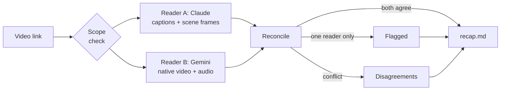

AI video summaries have a dangerous superpower: they sound 100% confident even
when they're wrong.

If you rely on auto-captions, you miss the slides. If you sample sparse frames,
you miss the fine print. And if a model meets a product newer than its training
data, it may decide the video is fake.

So I built **/yt-recap**, a Claude Code skill that works like a two-editor
newsroom: two models with different blind spots write up the same video
independently, and nothing reaches the note until they've been checked against
each other.

## Two readers, one recap

- **Scope first.** Checks the runtime and asks what you want, a full breakdown or the key takeaways, before spending any tokens. Anything over 20 minutes gets scoped to a section unless you insist.
- **Reader A (Claude)** reads timestamped captions and scene-change keyframes pulled by /watch, and writes its notes before it sees Gemini's.
- **Reader B (Gemini)** watches the video itself on Google's side, frames and audio together, and writes its own.
- **Reconciliation.** What both readers support goes into the recap. Claims only one reader made, and every conflict, get their own sections instead of being blended in.
- **Output.** A Markdown recap in its own folder, with key takeaways, exact names and numbers, and the flagged lists, saved next to both readers' notes.

## The stress test

I ran it on Apple's full 77-minute September 2026 keynote. Neither model got it
right on its own.

- **Gemini decided the keynote was fake.** It called the event a fan-made concept, because the products were newer than its training data. Reader A had the video's source, Apple's own channel, that same week, so the recap filed it as a disagreement instead of a fact.
- **The captions garbled the prices.** Auto-captions read the iPhone 18 Pro as "$11.99". Both readers took that to mean $1,199, but no price slide landed in the sampled frames, so the recap marks the price unconfirmed rather than stating it.
- **The frames missed the fine print.** Gemini reported "Not available in the EU and China" disclaimers that none of Claude's 100 frames across 77 minutes captured. They're in the recap, flagged as seen by one reader only.

## Where it goes next

- **Settle conflicts from the screen.** When the readers disagree, pull high-resolution frames at those moments automatically and resolve it from what's actually shown.
- **Autonomous research.** One agent finds a topic, another curates a playlist, and this skill works through the whole queue.
- **Ground truth for RAG.** The recaps are already structured Markdown, so hours of technical video can become checked context for documentation and other agents.
- **Meta-learning.** A sibling skill, /youtube-to-agent, already runs the same two-reader pass on engineering tutorials and turns what it learns into a new Claude Code skill.

Built on Brad Bonanno's open-source /watch skill and the two-reader method from
Jens Heitmann's YouTube to Agent Engine guide, with /watch adapted to run on a
single Gemini key.

One model gives you confidence. Two models that have to agree show you where
that confidence was earned.
